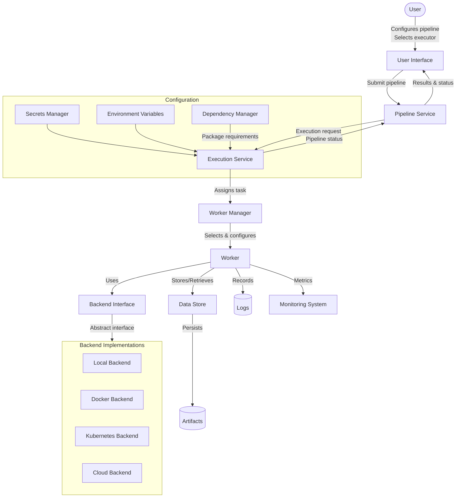

# Universal Execution Backend Design

## Key Concepts

### Worker
- Entity responsible for executing pipeline steps
- Types: Local, Custom, Cloud
- Handles the actual execution environment setup
- Constraint: A pipeline starts on a worker and finishes on the same worker

### Data Store
- Database abstraction for storing artifacts
- Provides consistent interface for different storage backends
- Enables artifact sharing across steps and pipelines
- Handles persistence and retrieval of execution results

### Artifact
- Unit of data which is an output of a step and becomes input for another step
- Needs serialization/deserialization mechanisms
- May require different storage strategies based on size and type
- Fundamental for data flow between pipeline steps

## Key Questions and Concerns

### Requirements Clarification
- What exactly does a "pipeline step" consist of? (Python code, shell commands, etc.)
- What metadata/configuration needs to be passed to each execution backend?
- What information needs to be returned from an execution?
- How should we handle inputs/outputs between pipeline steps?
- What level of isolation is required between steps?

### Architecture Considerations
- Should backends be synchronous or asynchronous?
- How will state management work across different environments?
- How do we handle environment variables, secrets, and configuration?
- What isolation guarantees do we need between steps?
- How do we ensure consistent behavior across different execution environments?
- How do we maintain pipeline execution on a single worker while potentially using different backend types?
- How do we scale workers for cloud execution scenarios?

### Integration Questions
- How does this fit into the existing pipeline service?
- What's the minimal API needed for the execution backends?
- How do we handle logging and monitoring across backends?
- How should errors and retries be managed?
- How do we track execution status across different backend types?
- How do we connect to cloud platforms similar to Bitbucket pipelines running on custom hosts?

### MVP Approach
1. Define a clean `ExecutionBackend` interface/protocol with minimal required methods
2. Implement a simple `LocalExecutionBackend` for process execution
3. Create basic integration with the existing pipeline service
4. For bonus: Implement a simple `DockerExecutionBackend`
5. Add configuration handling for different backends
6. Implement artifact passing between steps

## Design Considerations

### Backend Interface
The core interface should be simple yet flexible enough to support various execution environments:
- Method to submit/start execution
- Method to check execution status
- Method to retrieve results/outputs
- Method to cancel/terminate execution
- Configuration mechanism for backend-specific settings

### Worker Management
- Worker registration and discovery
- Worker health monitoring
- Resource allocation and scheduling
- Worker-to-backend mapping

### Data Flow
- How inputs are provided to the execution environment
- How outputs are captured and returned
- How logs and metrics are collected
- How artifacts are passed between steps
- Artifact storage and retrieval mechanisms

### Error Handling
- Standardized error reporting across backends
- Retry mechanisms and policies
- Graceful failure handling
- Worker failure recovery

### Security Considerations
- Credential management for different backends
- Secure transmission of sensitive data
- Isolation between executions
- Worker authentication and authorization

### Scalability
- Worker pools for handling multiple pipelines
- Dynamic scaling of worker resources
- Load balancing across available workers
- Cloud integration for on-demand capacity

## Potential Backend Implementations

- Local Process Execution
- Docker Container Execution
- Kubernetes Job Execution
- Cloud Function Execution (AWS Lambda, Google Cloud Functions)
- Remote SSH Execution
- Specialized ML Platform Execution (SageMaker, Vertex AI) 

## System Components Relationship



## Pipeline Execution Flow with Artifacts

```mermaid
flowchart TD
    %% Pipeline configuration
    Config[Pipeline Configuration] --> |Defines| Pipeline
    Pipeline --> |Execution Mode| ExecutionMode{Execution Mode}
    ExecutionMode --> |Serial| SerialExec[Serial Execution]
    ExecutionMode --> |Parallel| ParallelExec[Parallel Execution]
    ExecutionMode --> |Batch| BatchExec[Parallel Batch Execution]
    
    %% First step execution
    Pipeline --> |First Step| Step1[Step 1]
    Step1 --> |Produces| Artifacts1[Artifacts]
    
    %% Artifact storage
    Artifacts1 --> |Store| ArtifactDB[(Artifact Database)]
    ArtifactDB --> |"Standardized Naming<br/>(step_id/artifact_name/version)"| VersionedArtifacts
    
    %% Parallel execution branch
    ParallelExec --> |Fetch Artifacts| Artifacts1
    Artifacts1 --> |Input to| Step2A[Step 2A]
    Artifacts1 --> |Input to| Step2B[Step 2B]
    Artifacts1 --> |Input to| Step2C[Step 2C]
    
    %% Serial execution branch
    SerialExec --> |Fetch Artifacts| Artifacts1
    Artifacts1 --> |Input to| Step2[Step 2]
    Step2 --> |Produces| Artifacts2[Artifacts]
    Artifacts2 --> |Store| ArtifactDB
    Artifacts2 --> |Input to| Step3[Step 3]
    
    %% Batch execution branch
    BatchExec --> |Fetch & Batch| Artifacts1
    Artifacts1 --> |Batch 1| Batch1[Batch 1]
    Artifacts1 --> |Batch 2| Batch2[Batch 2]
    Batch1 --> |Process| BatchStep1[Step 2 (Batch 1)]
    Batch2 --> |Process| BatchStep2[Step 2 (Batch 2)]
    
    %% Error handling
    Step2B --> |App Error| RetryMechanism{Retry?}
    RetryMechanism --> |Yes| RetryCount[Check Retry Count]
    RetryCount --> |< Max| Step2B
    RetryCount --> |>= Max| FailureHandler[Failure Handler]
    RetryMechanism --> |No (Business Error)| FailureHandler
    FailureHandler --> |Notify| Alerts([Email/Slack Alerts])
    FailureHandler --> |Callback| Webhooks([Webhook Callbacks])
    
    %% Completion
    Step3 --> |Completion| PipelineComplete[Pipeline Complete]
    
    %% Monitoring
    Step1 -.-> |Logs| LogSystem[(Logging System)]
    Step2A -.-> |Logs| LogSystem
    Step2B -.-> |Logs| LogSystem
    Step2C -.-> |Logs| LogSystem
    Step3 -.-> |Logs| LogSystem
```

## Artifact Management

### Standardized Naming and Paths

Proper artifact naming and organization is crucial for reproducibility and preventing collisions:

- **Naming Convention**: `{pipeline_id}/{step_id}/{artifact_name}/{version}`
- **Unique IDs**: Generated for each pipeline run and step execution
- **Versioning**: Artifacts are versioned with each new generation
- **Metadata**: Includes creation timestamp, source step, size, and content type

### Immutable Versioned Artifacts

Artifacts should be treated as immutable to enable:

- **Traceability**: Track exactly which version of an artifact was used in which pipeline execution
- **Caching**: Reuse previously generated artifacts when inputs haven't changed
- **Backtracking**: Ability to reproduce previous pipeline runs with exact same artifacts
- **Auditability**: Understand how data has transformed over time

### Centralized Artifact Storage

A centralized artifact repository provides:

- **Shared Access**: All workers can access artifacts regardless of where they execute
- **Consistency**: Single source of truth for artifact data
- **Scalability**: Database-backed storage can scale with increasing artifact size and count
- **Performance**: Optimized storage based on artifact size and access patterns
  - Small artifacts (<10MB): Directly in database
  - Medium artifacts (<1GB): Object storage with database metadata
  - Large artifacts (>1GB): Specialized blob storage with reference in database

### Artifact Lifecycle Management

Proper artifact lifecycle management is essential:

- **Default Retention**: 14-day expiration for artifacts
- **Custom Retention Policies**: Configurable per pipeline or artifact type
- **Important Artifact Preservation**: Options to mark artifacts for permanent storage
- **Automatic Cleanup**: Background jobs to remove expired artifacts
- **Storage Monitoring**: Track artifact storage usage trends

## Environment Isolation

### Security Concerns

Proper environment isolation is critical to prevent:

- **Credential Leakage**: Secrets from one pipeline leaking to another
- **Data Contamination**: Data from one pipeline affecting another's execution
- **Resource Contention**: High-resource tasks affecting performance of others
- **Version Conflicts**: Package dependency conflicts between different pipelines

### Environment Creation

Each step execution requires a properly isolated environment:

- **Fresh Environment**: Each step starts with a clean, isolated environment
- **Dependency Installation**: Required packages installed based on step configuration
- **Environment Variables**: Set according to pipeline configuration
- **Resource Limits**: CPU, memory, and disk quotas enforced
- **Network Isolation**: Optional network namespace isolation

### Isolation Mechanisms

Different backends provide different isolation mechanisms:

- **Local Backend**: Process isolation with environment variables
- **Docker Backend**: Container isolation with virtual filesystems
- **Kubernetes Backend**: Pod isolation with resource quotas
- **Cloud Backend**: Function/job isolation with security boundaries

## Monitoring and Observability

### Execution Logs

Comprehensive logging for all pipeline executions:

- **Log Capture**: All stdout/stderr from step execution captured
- **Structured Logging**: JSON-formatted logs for machine parsing
- **Log Levels**: Support for DEBUG, INFO, WARNING, ERROR levels
- **Context Enrichment**: Logs enriched with pipeline/step metadata
- **Log Retention**: Configurable log retention periods

### Metrics and Monitoring

Performance and health metrics:

- **Execution Time**: Track duration of each step and overall pipeline
- **Resource Usage**: CPU, memory, disk, and network utilization
- **Success Rates**: Track success/failure ratios for steps and pipelines
- **Worker Health**: Monitor worker availability and performance
- **Database Performance**: Track artifact storage and retrieval metrics

## Error Handling and Recovery

### Error Types

Different error types require different handling:

- **Application Errors**: Code exceptions, crashes, resource limits
  - Often transient and can be resolved with retries
  - Examples: Network timeouts, resource contention, race conditions
- **Business Errors**: Logic errors related to data or business rules
  - Retries unlikely to succeed without input changes
  - Examples: Invalid input formats, business rule violations, data quality issues

### Retry Mechanism

Configurable retry settings:

- **Retry Count**: Maximum number of retry attempts (default: 3)
- **Retry Delay**: Time between retry attempts (default: exponential backoff)
- **Selective Retry**: Only retry specific error types
- **Idempotency**: Ensure steps can be safely retried without side effects

### Failure Handling

When retries are exhausted or errors are non-retryable:

- **Alert Notifications**: Email, Slack, or other notification channels
- **Webhook Callbacks**: HTTP callbacks to external systems
- **Failure Metadata**: Detailed information about the failure
- **Partial Results**: Option to preserve partial results from failed runs
- **Manual Intervention**: Ability to manually restart from failure point
