# Pulsr - ML Pipeline Orchestration API Design

## Overview

Pulsr is a lightweight ML pipeline orchestration API that enables users to define, execute, and monitor ML pipelines. This document outlines the system architecture, data models, API design, and implementation approach.

## Core Entities

- **Pipeline**: Defines a workflow consisting of multiple interconnected steps
- **Pipeline Run**: An execution instance of a pipeline with tracking capabilities  
- **Step**: Atomic unit of work within a pipeline with dependency relationships
- **Step Run**: Individual step execution within a pipeline run context
- **Artifact**: Data containers that flow between steps (inputs/outputs) - supports both file references (`uri`) and inline text data (`data`)

## System Overview

```mermaid
graph TB
    User[👤 User] --> API[🚀 FastAPI Service]
    API --> DB[(🗄️ SQLite Database)]
    
    subgraph CW["Core Workflow"]
        A[📝 Define Pipeline] --> B[🔗 Configure Step Dependencies]
        B --> C[🚀 Trigger Pipeline Run]
        C --> D[⚡ Execute Steps]
        D --> E[📊 Track Progress]
        E --> F[✅ Complete Run]
    end
    
    subgraph "Data Flow"
        Step1[Step 1] --> Artifact1[📦 Artifact]
        Artifact1 --> Step2[Step 2]
        Step2 --> Artifact2[📦 Artifact]
        Artifact2 --> Step3[Step 3]
    end
    
    API --> CW
```



## API Workflow Sequence


## Data Models & Relationships


**⚠️ Note**: The `StepDependency` model includes deadlock protection through topological sorting validation during pipeline creation and execution scheduling.

## Model Attributes

### Pipeline
- `id`: UUID primary key
- `name`: Human-readable pipeline name  
- `description`: Optional detailed description
- `created_at`, `updated_at`: Timestamps

### Step
- `id`: UUID primary key
- `pipeline_id`: Foreign key to Pipeline
- `name`: Step identifier within pipeline
- `description`: Step purpose description
- `command`: Executable command/script (bash command or script path)
- Dependencies via separate `StepDependency` table

### Pipeline Run
- `id`: UUID primary key
- `pipeline_id`: Foreign key to Pipeline
- `status`: Enum (pending, running, completed, failed, cancelled)
- `started_at`, `completed_at`: Execution timestamps
- `created_at`: Creation timestamp

### Step Run
- `id`: UUID primary key
- `step_id`, `pipeline_run_id`: Foreign keys
- `status`: Enum (pending, running, completed, failed, skipped)
- `logs`: Execution output/logs (stdout/stderr)
- `metadata`: JSON for execution metrics (duration, exit_code, memory_usage, custom_metrics, etc.)
- `started_at`, `completed_at`: Execution timestamps

### Artifact
- `id`: UUID primary key
- `name`: Artifact identifier
- `artifact_type`: Type classification (`file` or `text`)
- `uri`: Storage location/path (for `file` type artifacts)
- `data`: Inline text content (for `text` type artifacts)
- `metadata`: JSON metadata (size, checksum, description, etc.)
- `created_by_step_run_id`: Foreign key to producing step run

**Note**: For `text` type artifacts, data is stored directly in the `data` field. For `file` type artifacts, the `uri` field contains the file path/location and `data` field remains null.

## API Endpoints

Core endpoints implementing the challenge requirements:

- `POST /pipelines` - Register a new pipeline (with steps and dependencies)
- `GET /pipelines` - List all pipelines  
- `GET /pipelines/{pipeline_id}` - Get pipeline details with steps
- `POST /pipelines/{pipeline_id}/trigger_run` - Start a new pipeline run
- `GET /pipelines/{pipeline_id}/runs` - List all runs of a pipeline
- `GET /pipelines/{pipeline_id}/runs/{run_id}` - Get run details with step runs and artifacts

## Code Structure

```
pulsr/
├── app/
│   ├── __init__.py
│   ├── main.py                    # FastAPI application entry point
│   ├── core/
│   │   ├── __init__.py
│   │   ├── config.py              # Configuration settings
│   │   ├── database.py            # Database connection & session
│   │   └── exceptions.py          # Custom exception definitions
│   ├── models/
│   │   ├── __init__.py
│   │   ├── base.py                # Base SQLModel class
│   │   ├── pipeline.py            # Pipeline, PipelineRun & StepDependency models
│   │   ├── step.py                # Step, StepRun models
│   │   └── artifact.py            # Artifact & ArtifactUsage models
│   ├── api/
│   │   ├── __init__.py
│   │   ├── deps.py                # Dependency injection (DB sessions, etc.)
│   │   └── v1/
│   │       ├── __init__.py
│   │       ├── pipelines.py       # Pipeline endpoints
│   │       └── runs.py            # Pipeline run endpoints
│   ├── services/
│   │   ├── __init__.py
│   │   ├── pipeline_service.py    # Pipeline business logic
│   │   ├── execution_service.py   # Pipeline execution logic
│   │   └── validation_service.py  # Dependency validation & topological sort
│   └── utils/
│       ├── __init__.py
│       └── topological_sort.py    # Dependency graph utilities
├── tests/
│   ├── __init__.py
│   ├── conftest.py                # Pytest configuration
│   ├── test_models.py             # Model unit tests
│   ├── test_api.py                # API endpoint tests
│   └── test_services.py           # Service layer tests
├── pyproject.toml                 # UV project configuration & dependencies
├── Dockerfile
└── docker-compose.yml
```

## Architecture Principles

### Separation of Concerns
- **Models**: SQLModel classes serving both DB persistence and API validation
- **Services**: Business logic and orchestration with custom exceptions (PipelineRunError, StepRunError)
- **API**: HTTP request handling and routing
- **Utils**: Shared utilities and helpers

### Dependency Injection
- Database sessions injected via FastAPI dependencies
- Service instances created per request
- Configuration loaded from environment variables

### Error Handling
- Custom exception hierarchy defined in service modules
- Global exception handlers for consistent API responses
- Validation errors automatically handled by SQLModel/Pydantic

### Background Processing
- FastAPI background tasks for pipeline execution
- Simple in-process execution for demo purposes

**Note**: Initially using models directly for API requests/responses. Future improvement will introduce separate schemas (BasePipeline, CreatePipeline, RetrievePipeline) for better API contract management.

## Technology Stack

- **FastAPI**: Async web framework with automatic OpenAPI docs
- **SQLModel**: Type-safe ORM combining SQLAlchemy + Pydantic  
- **SQLite**: Lightweight database with table recreation on startup
- **UV**: Fast Python package installer and resolver
- **Pytest**: Testing framework with async support

## Future Enhancements

### Core Feature Extensions
- **Pipeline Versioning**: Version control for pipeline definitions and history
- **Step Environment Variables**: JSON field for environment variables and runtime configuration
- **Step Retry Policies**: Configurable retry logic with backoff strategies
- **Pipeline Parameters**: Runtime variables exposed as environment variables to step executors
- **Extended API Endpoints**: 
  - Package management (`POST /packages`, `GET /packages`)
  - Pipeline updates (`PUT /pipelines/{id}`, `DELETE /pipelines/{id}`)
  - Run cancellation (`POST /runs/{id}/cancel`)
  - Artifact management (`GET /artifacts`, `GET /artifacts/{id}`)
  - Step-level run details (`GET /runs/{id}/steps/{step_id}`)

### Data & Schema Management
- **Separate Request/Response Schemas**: BasePipeline, CreatePipeline, RetrievePipeline patterns
- **Database Migrations**: Alembic integration for PostgreSQL schema management
- **Artifact Lineage**: Enhanced tracking beyond step run relationships

### Authentication & Authorization
- **OAuth2/OIDC Integration**: Support for Google, GitHub, Azure AD
- **Role-Based Access Control**: Package/pipeline level permissions
- **API Key Management**: Service-to-service authentication

### Scalability & Performance
- **Task Queue Integration**: Replace FastAPI background tasks with ARQ/Celery
- **Rate Limiting**: Redis-based rate limiting per user/API key
- **Caching Layer**: Redis for frequently accessed data
- **Database Scaling**: PostgreSQL with read replicas

### Monitoring & Observability
- **Metrics Collection**: Prometheus integration
- **Distributed Tracing**: OpenTelemetry support
- **Log Aggregation**: Structured logging with correlation IDs
- **Health Checks**: Kubernetes-ready health endpoints

### Cloud-Native Deployment
- **GCP Integration**: 
  - Cloud Run for API deployment
  - Cloud SQL for managed PostgreSQL
  - Cloud Storage for artifact storage
  - Cloud Monitoring for observability
- **Kubernetes Support**: Helm charts and operators
- **CI/CD Pipeline**: GitHub Actions with GCP deployment

### Advanced Pipeline Features
- **Pipeline Scheduling**: Cron-like scheduling capabilities
- **Conditional Execution**: Skip steps based on conditions
- **Parallel Execution**: Run independent steps concurrently
- **Artifact Caching**: Skip step execution if inputs unchanged
- **Pipeline Templates**: Reusable pipeline definitions 
